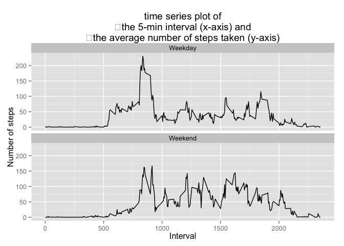

# Reproducible Research: Peer Assessment 1
corrado.lanera@unipd.it  


## Loading and preprocessing the data

### Loading
Loading data *activity.csv* from the *activity.zip* file and store them in 
an *activity.data* variable.


```r
activity.data <- read.csv(                                           # Read data
						unz("activity.zip",                    # unzip from .zip
							"activity.csv")                      # the .csv file
						)
```

Explore data


```r
str(activity.data)                            # Explore the structure of dataset
```

```
## 'data.frame':	17568 obs. of  3 variables:
##  $ steps   : int  NA NA NA NA NA NA NA NA NA NA ...
##  $ date    : Factor w/ 61 levels "2012-10-01","2012-10-02",..: 1 1 1 1 1 1 1 1 1 1 ...
##  $ interval: int  0 5 10 15 20 25 30 35 40 45 ...
```

```r
head(activity.data)                                            # explore dataset
```

```
##   steps       date interval
## 1    NA 2012-10-01        0
## 2    NA 2012-10-01        5
## 3    NA 2012-10-01       10
## 4    NA 2012-10-01       15
## 5    NA 2012-10-01       20
## 6    NA 2012-10-01       25
```

```r
tail(activity.data)                                            # explore dataset
```

```
##       steps       date interval
## 17563    NA 2012-11-30     2330
## 17564    NA 2012-11-30     2335
## 17565    NA 2012-11-30     2340
## 17566    NA 2012-11-30     2345
## 17567    NA 2012-11-30     2350
## 17568    NA 2012-11-30     2355
```

###Processing
Data is store in a data.frame. We load *dplyr* for manage it.

* Check for installed packages


```r
installed <- installed.packages()                   # list of installed packages
```

Installing and loading *dplyr* if needed


```r
if (!("dplyr" %in% installed))                                # if not installed
        install.packages("dplyr",
                         dependencies = TRUE,
                         repos = getOptions("http://cran.us.r-project.org")
                         )                                          # install it
require(dplyr)                                # load it, if it isn't just loaded
```

```
## Loading required package: dplyr
## 
## Attaching package: 'dplyr'
## 
## The following object is masked from 'package:stats':
## 
##     filter
## 
## The following objects are masked from 'package:base':
## 
##     intersect, setdiff, setequal, union
```


## What is mean total number of steps taken per day?

###Plot the data
First plot the sum of non-NA steps per day.


```r
sum.per.date <- activity.data %>%                        # take the non NA value
				group_by(date) %>%                   # firstly groped it by date
				summarize(
					steps = sum(steps, na.rm = TRUE)
					)        # then sum steps each day counting zero the NA ones

head(sum.per.date)                                          # explore the result
```

```
## Source: local data frame [6 x 2]
## 
##         date steps
## 1 2012-10-01     0
## 2 2012-10-02   126
## 3 2012-10-03 11352
## 4 2012-10-04 12116
## 5 2012-10-05 13294
## 6 2012-10-06 15420
```

```r
tail(sum.per.date)                                          # explore the result
```

```
## Source: local data frame [6 x 2]
## 
##         date steps
## 1 2012-11-25 11834
## 2 2012-11-26 11162
## 3 2012-11-27 13646
## 4 2012-11-28 10183
## 5 2012-11-29  7047
## 6 2012-11-30     0
```

```r
hist(sum.per.date$steps,                     # histogram of total steps each day
	  main = "Histogram of total number of steps each day",
	  xlab = "Total number of steps"
	  )
```

 

###Computations
Next compute the mean and median.


```r
mean.steps.per.day <- mean(sum.per.date$steps)           # compute avarage value
median.steps.per.day <- median(sum.per.date$steps)        # compute median value

mean.steps.per.day                                                # show avarage
```

```
## [1] 9354.23
```

```r
median.steps.per.day                                               # show median
```

```
## [1] 10395
```

The mean of the steps taken each day is 9354.2295082, while the median
is 10395.

## What is the average daily activity pattern?

Take the mean number of steps grouped by 5-min interval,


```r
avr.per.date <- activity.data %>%                        # take the non NA value
				group_by(interval) %>%     # firstly groped it by 5-min interval
				summarize(
					steps = mean(steps, na.rm = TRUE)
					)                        # then take avarage number of steps

head(avr.per.date)                                          # explore the result
```

```
## Source: local data frame [6 x 2]
## 
##   interval     steps
## 1        0 1.7169811
## 2        5 0.3396226
## 3       10 0.1320755
## 4       15 0.1509434
## 5       20 0.0754717
## 6       25 2.0943396
```

```r
tail(avr.per.date)                                          # explore the result
```

```
## Source: local data frame [6 x 2]
## 
##   interval     steps
## 1     2330 2.6037736
## 2     2335 4.6981132
## 3     2340 3.3018868
## 4     2345 0.6415094
## 5     2350 0.2264151
## 6     2355 1.0754717
```

and plot value in a time series plot.


```r
plot(avr.per.date,                        # plot interval avarage steps on a day
	 type = "l",                                                # as time series
	 xlab = "time",                                               # x-axis label
	 y = "steps")                                                 # y-axis label
```

 

Find the 5-min interval across all the day in which there is the maximum number
of steps.


```r
interval.max.steps <- avr.per.date %>% filter(steps == max(steps))
interval.max.steps["interval"]        # 5-min interval reached the max avr steps
```

```
## Source: local data frame [1 x 1]
## 
##   interval
## 1      835
```

Max avarage steps taken in a day is 206.1698113 and it is
taken at the 835 5-min interval.

## Imputing missing values
###Compute NAs
Compute the number of missing value row.


```r
NA.steps <- activity.data %>%
				filter(is.na(steps))                  # take steps with NA value
num.of.NA <- dim(NA.steps)[1]			                        # and count them
num.of.NA
```

```
## [1] 2304
```

NA value are 2304.

###Fill NAs
Choose to fill the NA values with the corresponding avarage value at
5-min avarage number of steps.


```r
complete.activity.data <<- activity.data                    # copy original data

for (i in 1:dim(complete.activity.data)[1]){                    # range on cases
	if (is.na(complete.activity.data$steps[i])){                   # for NA data
		complete.activity.data$steps[i] <- avr.per.date$steps[    # sbs with avr
			which(avr.per.date$interval == complete.activity.data$interval[i])
		]	
	}
}

## Explore and visual compare the datasets
head(complete.activity.data)
```

```
##       steps       date interval
## 1 1.7169811 2012-10-01        0
## 2 0.3396226 2012-10-01        5
## 3 0.1320755 2012-10-01       10
## 4 0.1509434 2012-10-01       15
## 5 0.0754717 2012-10-01       20
## 6 2.0943396 2012-10-01       25
```

```r
head(activity.data)
```

```
##   steps       date interval
## 1    NA 2012-10-01        0
## 2    NA 2012-10-01        5
## 3    NA 2012-10-01       10
## 4    NA 2012-10-01       15
## 5    NA 2012-10-01       20
## 6    NA 2012-10-01       25
```

```r
tail(complete.activity.data)
```

```
##           steps       date interval
## 17563 2.6037736 2012-11-30     2330
## 17564 4.6981132 2012-11-30     2335
## 17565 3.3018868 2012-11-30     2340
## 17566 0.6415094 2012-11-30     2345
## 17567 0.2264151 2012-11-30     2350
## 17568 1.0754717 2012-11-30     2355
```

```r
tail(activity.data)
```

```
##       steps       date interval
## 17563    NA 2012-11-30     2330
## 17564    NA 2012-11-30     2335
## 17565    NA 2012-11-30     2340
## 17566    NA 2012-11-30     2345
## 17567    NA 2012-11-30     2350
## 17568    NA 2012-11-30     2355
```

Consider new histogram and mean and median value for "complete" dataset.


```r
complete.sum.per.date <- complete.activity.data %>%                   # as above
							group_by(date) %>%
							summarize(steps = sum(steps)
									  )          # note: no need of na.rm = TURE

head(complete.sum.per.date)                                 # explore the result
```

```
## Source: local data frame [6 x 2]
## 
##         date    steps
## 1 2012-10-01 10766.19
## 2 2012-10-02   126.00
## 3 2012-10-03 11352.00
## 4 2012-10-04 12116.00
## 5 2012-10-05 13294.00
## 6 2012-10-06 15420.00
```

```r
tail(complete.sum.per.date)                                 # explore the result
```

```
## Source: local data frame [6 x 2]
## 
##         date    steps
## 1 2012-11-25 11834.00
## 2 2012-11-26 11162.00
## 3 2012-11-27 13646.00
## 4 2012-11-28 10183.00
## 5 2012-11-29  7047.00
## 6 2012-11-30 10766.19
```

```r
hist(complete.sum.per.date$steps,
	  main = "Histogram of total number of steps each day for complete dataset",
	  xlab = "Total number of steps"
	  )
```

 

```r
complete.mean.steps.per.day <- mean(complete.sum.per.date$steps)
complete.median.steps.per.day <- median(complete.sum.per.date$steps)

complete.mean.steps.per.day
```

```
## [1] 10766.19
```

```r
complete.median.steps.per.day
```

```
## [1] 10766.19
```
The mean of the steps taken each day is 1.0766189\times 10^{4},
while the median is 1.0766189\times 10^{4}, which are different from
the value considered without removing NA values.

The differences are respectively 
1411.959171 and 
371.1886792.

Those differences rise mainly from the first part of histogram (of course
because NA were considered as *zero*) which is reparted in the central part of
histogram. We have to observe that both mean and median were increase a lot.

## Are there differences in activity patterns between weekdays and weekends?

Create a new factor variable in the dataset with two levels – “weekday” and
“weekend” indicating whether a given date is a weekday or weekend day


```r
avr.steps.week.end <- complete.activity.data %>%
					mutate(date = as.Date(date, "%Y-%m-%d")) %>%  # convert date
					mutate(days = weekdays(date)) %>%# new var for names of days
					mutate(week =                      # new var for type of day
							ifelse(                            # if in a weekend
								(days == "Sabato" | days == "Domenica"),
								"Weekend",             # label record as weekend
								"Weekday"                        # else: weekday
								)) %>%
							group_by(week, interval)%>% # group by type and time
							summarize(steps = mean(steps)
									  )           # avr steps each type and time 

head(avr.steps.week.end)                                    # explore the result
```

```
## Source: local data frame [6 x 3]
## Groups: week
## 
##      week interval      steps
## 1 Weekday        0 2.25115304
## 2 Weekday        5 0.44528302
## 3 Weekday       10 0.17316562
## 4 Weekday       15 0.19790356
## 5 Weekday       20 0.09895178
## 6 Weekday       25 1.59035639
```

```r
tail(avr.steps.week.end)                                    # explore the result
```

```
## Source: local data frame [6 x 3]
## Groups: week
## 
##      week interval       steps
## 1 Weekend     2330  1.38797170
## 2 Weekend     2335 11.58726415
## 3 Weekend     2340  6.28773585
## 4 Weekend     2345  1.70518868
## 5 Weekend     2350  0.02830189
## 6 Weekend     2355  0.13443396
```

And make a panel plot containing a time series plot of the 5-minute interval (x-axis) and the average number of steps taken, averaged across all weekday days or weekend days (y-axis)


```r
library(ggplot2)
qplot(data = avr.steps.week.end, x = interval, y = steps, 
	geom=c("line"),                                             # as time series
	xlab="Interval", #
	ylab="Number of steps",
	main="time series plot of
	the 5-min interval (x-axis) and
	the average number of steps taken (y-axis)"
	) + 
	facet_wrap(~ week, ncol=1)                          # split the plot by type
```

 

Yes, there are differences: on weekends steps starts later (we still in bad more, probably) but we walk more near lunch and first afternoon (we go out to eat probably).
